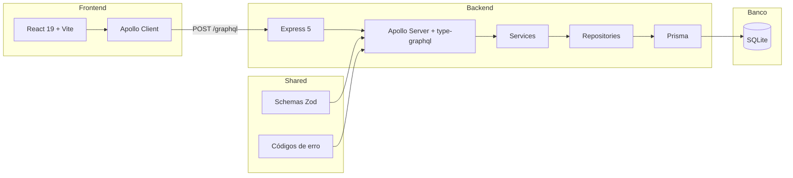

Aplicação web de controle financeiro pessoal. Cada usuário gerencia suas próprias categorias, registra receitas e despesas, acompanha um dashboard com resumos mensais e mantém seu perfil — tudo em português, com formatação de moeda e datas em `pt-BR`.

## Funcionalidades

| Área | O que faz |
|------|-----------|
| **Autenticação** | Cadastro, login com "lembrar de mim" e renovação automática de token |
| **Dashboard** | Saldo total, receitas/despesas do mês e transações recentes |
| **Transações** | Criar, editar e excluir receitas e despesas com filtros e paginação |
| **Categorias** | Categorias personalizadas com nome, ícone, cor e descrição |
| **Perfil** | Atualizar nome, visualizar e-mail e encerrar sessão |

## Estrutura de entrega (Rocketseat)

```
financy/
├── backend/    # API GraphQL
└── frontend/   # SPA React
```

O código compartilhado (schemas Zod e códigos de erro) fica em `backend/shared/` e é consumido pelos dois pacotes via workspace pnpm.

## Arquitetura

Monorepo pnpm com pacotes `frontend`, `backend` e `@financy/shared` (em `backend/shared/`).



| Pacote | Responsabilidade |
|--------|------------------|
| [`frontend`](frontend) | Interface React com Apollo Client, React Router e Tailwind CSS |
| [`backend`](backend) | API GraphQL com autenticação JWT, camadas de serviço e Prisma |
| [`backend/shared`](backend/shared) | Schemas de validação Zod e códigos de erro compartilhados |

## Stack

| Camada | Tecnologias |
|--------|-------------|
| Frontend | React 19, Vite 8, React Router 8, Apollo Client 4, Tailwind CSS 4, shadcn/ui |
| Backend | Express 5, Apollo Server 5, type-graphql, Prisma 7, SQLite |
| Qualidade | TypeScript 7, Vitest 4, Biome, Husky |
| Monorepo | pnpm workspaces |

## Estrutura do repositório

```
financy/
├── backend/          # API GraphQL (backend)
│   ├── shared/           # Schemas Zod e códigos de erro (@financy/shared)
│   ├── src/
│   │   ├── resolvers/    # Endpoints GraphQL
│   │   ├── services/     # Regras de negócio
│   │   ├── repositories/ # Acesso a dados
│   │   └── db/prisma/    # Schema, migrations e client gerado
│   └── schema.graphql    # SDL gerado (não editar manualmente)
├── frontend/         # SPA React (frontend)
│   └── src/
│       ├── pages/        # Páginas por rota
│       ├── hooks/        # Hooks Apollo
│       ├── components/   # Componentes da aplicação
│       └── components/ui/ # Primitivos shadcn (não editar)
├── AGENTS.md         # Convenções gerais do monorepo
├── biome.json        # Lint e formatação
└── pnpm-workspace.yaml
```

## Pré-requisitos

- **Node.js** 20 LTS ou superior (recomendado)
- **pnpm** 9 ou superior
- **Git**
- **Toolchain nativa de C++** — necessária para compilar `better-sqlite3` (Xcode Command Line Tools no macOS, `build-essential` no Linux)

Não é necessário Docker, PostgreSQL nem nenhum serviço externo. O banco é SQLite local.

## Primeiros passos

### 1. Clonar e instalar dependências

```bash
git clone git@github.com:miguelriosoliveira/financy.git
cd financy
pnpm install
```

O `pnpm install` também configura os hooks do Husky via script `prepare`.

### 2. Configurar variáveis de ambiente

**Backend** — copie o exemplo para `.env` (os valores já funcionam para desenvolvimento local):

```bash
cp backend/.env.example backend/.env
```

**Frontend** — o exemplo já traz um valor funcional:

```bash
cp frontend/.env.example frontend/.env
```

```env
VITE_BACKEND_URL=http://localhost:3000/graphql
```

O arquivo `backend/.env.test` já está versionado no repositório com valores seguros para a suíte de testes.

### 3. Criar o banco de dados

```bash
pnpm --filter backend db:migrate
```

Isso aplica as migrations e cria o arquivo SQLite em `backend/dev.db`.

### 4. Iniciar o ambiente de desenvolvimento

```bash
pnpm dev
```

| Serviço | URL |
|---------|-----|
| Frontend | http://localhost:5173 |
| Backend (GraphQL) | http://localhost:3000/graphql |

### 5. Verificar que tudo funciona

Execute a query de health check no endpoint GraphQL:

```graphql
query {
  health
}
```

Resposta esperada: `"ok"`.

Ou rode a suíte de qualidade completa:

```bash
pnpm lint && pnpm typecheck && pnpm test && pnpm build
```

## Variáveis de ambiente

### Backend (`backend/.env`)

| Variável | Obrigatória | Descrição |
|----------|-------------|-----------|
| `PORT` | Sim | Porta HTTP do servidor |
| `JWT_SECRET` | Sim | Segredo para assinar tokens JWT |
| `DATABASE_URL` | Sim | URL SQLite no formato `file:./dev.db` |

### Frontend (`frontend/.env`)

| Variável | Obrigatória | Descrição |
|----------|-------------|-----------|
| `VITE_BACKEND_URL` | Sim | URL do endpoint GraphQL (ex.: `http://localhost:3000/graphql`) |

### Testes (`backend/.env.test`)

Arquivo versionado em `backend/.env.test` com valores seguros para a suíte de testes. Não é necessário criá-lo manualmente após o clone.

## Scripts

### Raiz (monorepo)

| Comando | Descrição |
|---------|-----------|
| `pnpm dev` | Inicia backend e frontend em paralelo |
| `pnpm build` | Build de produção dos dois pacotes |
| `pnpm test` | Executa todos os testes |
| `pnpm typecheck` | Verificação de tipos TypeScript |
| `pnpm lint` | Formata e corrige com Biome |

### Backend

| Comando | Descrição |
|---------|-----------|
| `pnpm --filter backend dev` | Servidor com hot reload |
| `pnpm --filter backend build` | Bundle de produção (`dist/`) |
| `pnpm --filter backend start` | Executa o build de produção |
| `pnpm --filter backend test` | Todos os testes |
| `pnpm --filter backend test:unit` | Testes unitários (sem banco) |
| `pnpm --filter backend test:integration` | Testes de integração (com SQLite) |
| `pnpm --filter backend test:watch` | Testes em modo watch |
| `pnpm --filter backend db:migrate` | Aplica migrations (desenvolvimento) |
| `pnpm --filter backend db:generate` | Regenera o client Prisma |
| `pnpm --filter backend db:studio` | Abre o Prisma Studio |
| `pnpm --filter backend schema:generate` | Regenera `schema.graphql` |

### Frontend

| Comando | Descrição |
|---------|-----------|
| `pnpm --filter frontend dev` | Servidor Vite com HMR |
| `pnpm --filter frontend build` | Build de produção |
| `pnpm --filter frontend preview` | Pré-visualiza o build |
| `pnpm --filter frontend test` | Todos os testes |
| `pnpm --filter frontend test:watch` | Testes em modo watch |

## Banco de dados

O projeto usa **SQLite** via Prisma. Não há servidor de banco — apenas arquivos locais.

| Arquivo | Uso |
|---------|-----|
| `backend/dev.db` | Desenvolvimento (criado por `db:migrate`) |
| `backend/test.db` | Testes de integração (criado automaticamente) |

**Desenvolvimento:** use migrations com `pnpm --filter backend db:migrate`.

**Testes:** os testes de integração usam `prisma db push` para sincronizar o schema, não migrations.

**Após alterar `schema.prisma`:**

```bash
pnpm --filter backend db:migrate    # cria/aplica migration
pnpm --filter backend db:generate   # regenera o client
```

O client Prisma gerado em `backend/src/db/prisma/generated/` está versionado no git. Rode `db:generate` após mudanças no schema e commite o resultado.

## Testes

### Backend

Dois projetos Vitest:

- **Unitários** (`src/services/`, `src/utils/`) — dependências mockadas, sem banco
- **Integração** (`src/tests/`) — servidor Express real com SQLite de teste, execução sequencial

### Frontend

Vitest com jsdom e Testing Library. Use o helper `renderWithProviders` de `frontend/src/tests/helpers/render.tsx` para renderizar componentes com Apollo e Router mockados.

### Fluxo de qualidade

Após cada alteração, execute na ordem:

```bash
pnpm lint
pnpm typecheck
pnpm test
pnpm build
```

O hook de pre-commit (Husky) roda lint-staged, typecheck, build e test em cada commit.

## Convenções

- **Gerenciador de pacotes:** use apenas `pnpm` (nunca npm ou yarn)
- **Formatação:** Biome — rode `pnpm lint` em vez de formatar manualmente
- **Test-first:** escreva testes antes da implementação
- **Backend:** arquitetura resolver → service → repository → db client
- **Validação:** schemas Zod em `backend/shared`, aplicados via middleware nos resolvers
- **Código gerado — não editar manualmente:**
  - `backend/schema.graphql`
  - `backend/src/db/prisma/generated/`
  - `frontend/src/components/ui/`

Para detalhes por pacote, consulte [`AGENTS.md`](AGENTS.md), [`backend/AGENTS.md`](backend/AGENTS.md) e [`frontend/AGENTS.md`](frontend/AGENTS.md).

## API GraphQL

O schema canônico está em [`backend/schema.graphql`](backend/schema.graphql). Após alterar resolvers ou tipos GraphQL:

```bash
pnpm --filter backend schema:generate
```

**Operações públicas:** `health`, `register`, `login`, `refreshToken`

**Operações autenticadas:** `getMe`, `updateProfile`, CRUD de categorias e transações, `getDashboardSummary`, `getTransactionPeriods`

Autenticação via header `Authorization: Bearer <token>`.

## Solução de problemas

| Problema | Solução |
|----------|---------|
| Erro ao instalar `better-sqlite3` | Instale a toolchain nativa de C++ (Xcode CLT no macOS) |
| Backend não inicia | Verifique se `backend/.env` tem `PORT`, `JWT_SECRET` e `DATABASE_URL=file:./...` preenchidos |
| Frontend não conecta ao backend | Confirme que `VITE_BACKEND_URL` aponta para a porta correta do backend |
| Tabelas não existem | Rode `pnpm --filter backend db:migrate` |
| Pre-commit muito lento | O hook executa typecheck, build e test completos — comportamento esperado |
| `schema.graphql` desatualizado | Rode `pnpm --filter backend schema:generate` após mudanças nos resolvers |
